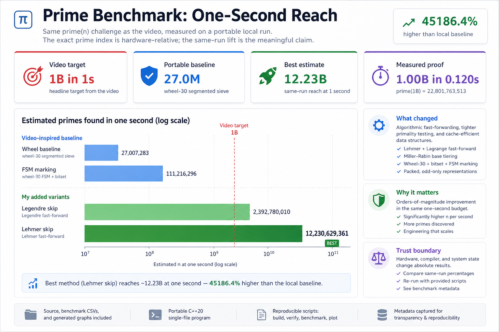
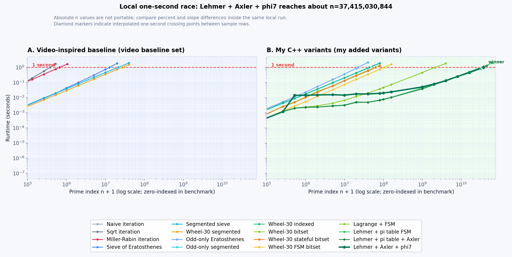
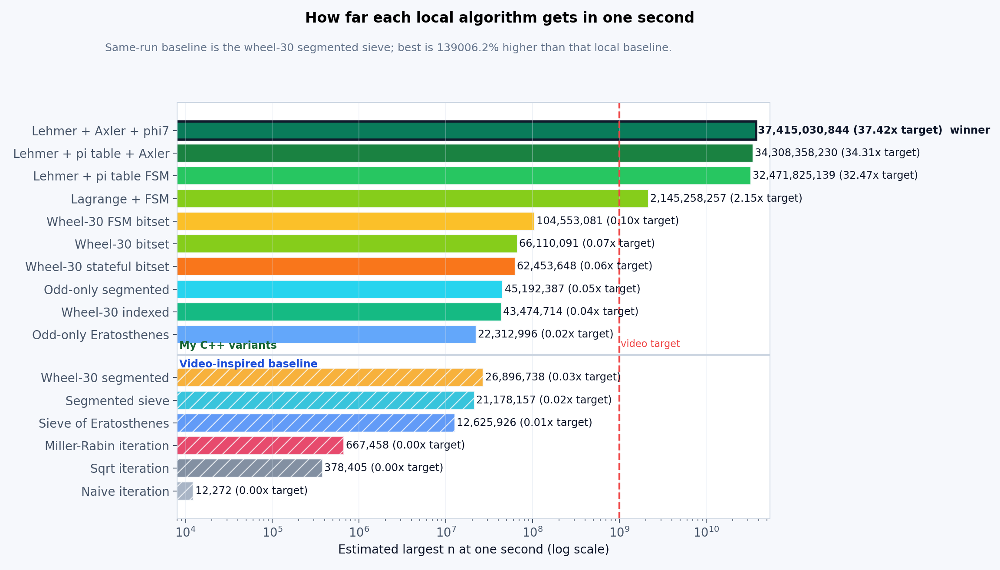

# Prime Code and Graphs

[](https://github.com/Stroudmj00/prime-code-and-graphs/actions/workflows/ci.yml)

Portable reproduction of the algorithm/code-and-graphs side of
["One second to find the BILLIONth PRIME"](https://www.youtube.com/watch?v=uJkoI5TnKzA).

## Recruiter Snapshot

**What this is:** a reproducible, inspectable implementation of the same `prime(n)` challenge from the video, with a complete benchmark-and-graph workflow.

**What was improved:** the upstream `SheafificationOfG/QueenJewels` baseline relies on Linux-only LLVM IR + syscalls; this project rehomes it to portable C++ on Windows, keeps the zero-indexed `prime(n)` definition, then layers measured algorithmic and implementation optimizations.

**Headline result:** on this machine, the current best method (`sieve-lagrange-lehmer-fsm`) reaches the video target `n = 1,000,000,000` in `0.120388s`, with an estimated one-second reach of `n = 12,230,629,361` (`45186.4%` gain over the pre-bitset wheel-30 segmented baseline and `1223.06%` of the video headline target).

**Skills this demonstrates:** algorithm design, optimization systems thinking, experimental benchmarking, performance analysis, reproducible visualization, and practical systems adaptation across OS/runtime constraints.

This project uses the same “what can we compute in one second?” framing as the video, but within a clearly defined scope: portable C++ reimplementation and incremental optimization, not Linux IR-level execution.

## Scope, Honesty, and Trust Boundaries

The scope is intentionally video-inspired, not a full reimplementation of every reference implementation detail.

- It preserves the original `prime(n)` task and zero-indexed convention.
- It measures progress on a fixed one-second budget and presents before/after results.
- It adds optimization ideas only when they still compute the target directly (no table-lookup shortcuts).
- It explicitly tracks that absolute values are hardware-relative.

## Current Local Score

Important disclaimer: the exact one-second prime index is hardware-relative. CPU, compiler, operating system, thermals, and background load can all move the absolute `n`. The useful comparison is the percentage improvement between algorithms measured in the same local benchmark run.

The latest one-second reach benchmark on this machine estimates:

```text
best local method:      sieve-lagrange-lehmer-fsm
video target proof:     n = 1,000,000,000 in 0.120388s
prime(1,000,000,000):   22,801,763,513
estimated 1s reach:     n = 12,230,629,361
measured over 1s:       n = 16,000,000,000 in 1.264290s
```

The pre-bitset wheel-30 segmented baseline reaches an estimated `n = 27,007,283` at one second. The Lehmer-assisted FSM method reaches `n = 12,230,629,361`, which is `45186.4%` higher on this machine.

The concrete milestone `n = 1,000,000,000` is exactly the video's headline target. The interpolated one-second reach, `n = 12,230,629,361`, is `1223.06%` of that target. The exact index is still hardware-relative; the durable claim is the same-run improvement between algorithms in this repo.

## Visualization Guide

The lead dashboard is a recruiter-facing summary of the benchmark story. It is designed to answer four questions without needing to read the benchmark table first:

- what the video was targeting: `n = 1,000,000,000` in one second;
- where the portable baseline landed: `n = 27,007,283` estimated at one second;
- where my best method landed: `n = 12,230,629,361` estimated at one second;
- what was directly measured: `n = 1,000,000,000` in `0.120388s`.

The runtime plot is the audit view: it cleanly separates the video-inspired baseline subset from my portable C++ improvements, and both panels keep the one-second line visible. The one-second reach plot is the raw ranking view generated from the benchmark CSV.







## Algorithms

This project now separates the video-inspired baseline subset from the variants added in this repo.

Video-inspired baseline subset:

- naive iteration
- square-root trial division
- deterministic Miller-Rabin iteration
- Sieve of Eratosthenes
- segmented Sieve of Eratosthenes
- wheel-30 segmented sieve

My portable C++ improvements:

- odd-only Sieve of Eratosthenes
- odd-only segmented Sieve of Eratosthenes
- wheel-30 indexed segmented sieve
- wheel-30 bitset segmented sieve
- wheel-30 stateful bitset segmented sieve
- wheel-30 FSM bitset segmented sieve
- Lagrange/Legendre fast-forward plus wheel-30 FSM bitset segmented sieve
- Lehmer fast-forward plus wheel-30 FSM bitset segmented sieve

## Build

Requirements:

- Python 3
- `clang++`, `g++`, or another C++20 compiler passed with `--cxx`
- Python plotting dependency: `python -m pip install -r requirements.txt`

Cross-platform:

```console
python scripts/build.py
python scripts/verify.py --fast
python scripts/plot.py
```

Windows launcher equivalent:

```console
py -3 scripts/build.py
py -3 scripts/verify.py --fast
py -3 scripts/plot.py
```

For a generic non-CPU-specific binary, use:

```console
python scripts/build.py --portable
```

## Run One Algorithm

```console
output/bin/prime_bench sieve-lagrange-lehmer-fsm 1000000000
```

The program prints the zero-indexed nth prime.

On Windows, the binary path is `output\bin\prime_bench.exe`.

## Generate Benchmark Data and Graphs

```console
python scripts/bench.py --repeats 3 --timeout 8 --full --reach-one-second -o output/data/benchmark.csv
python scripts/plot.py
```

For quick candidate comparisons without regenerating every graph:

```console
python scripts/compare.py --algorithms sieve-lagrange-fsm,sieve-lagrange-lehmer-fsm --n 1000000000,4000000000,8000000000 --repeats 3
```

Generated files:

```text
output/data/benchmark.csv
output/data/benchmark.meta.json
assets/recruiter_dashboard.png
output/graphs/story_scorecard.png
output/graphs/runtime_curves.png
output/graphs/one_second_reach.png
output/graphs/prime_growth.png
output/graphs/summary.md
```

## Notes

The one-second reach values are log-interpolated between measured samples around the one-second crossing. The summary file also shows the last measured point below one second and the next measured point above one second for each algorithm.

`output/data/benchmark.meta.json` records the local run context for the checked-in benchmark data. Future benchmark runs write a fresh metadata sidecar next to the requested CSV.

See `IMPROVEMENT.md` for the measured implementation improvements: Lehmer fast-forwarding, Lagrange/Legendre fast-forwarding, Miller-Rabin base tiering, wheel-30 indexing, wheel-30 bitset packing, wheel-30 FSM marking, packed odd-only dense sieving, and odd-only segmented sieving.
