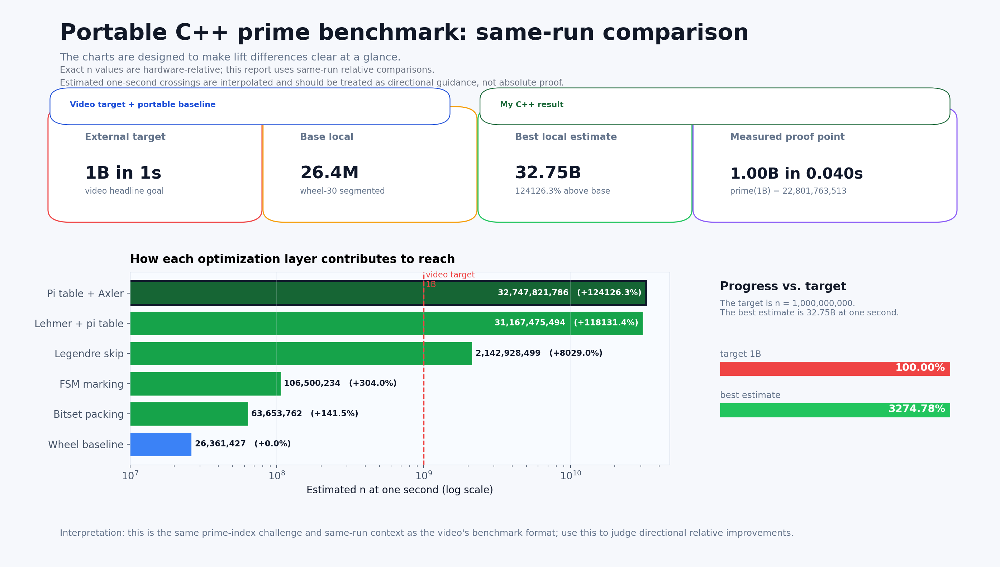

# Prime Code and Graphs

[](https://github.com/Stroudmj00/prime-code-and-graphs/actions/workflows/ci.yml)

Portable, video-inspired reproduction of the algorithm/code-and-graphs side of
["One second to find the BILLIONth PRIME"](https://www.youtube.com/watch?v=uJkoI5TnKzA).

## Recruiter Snapshot

**What this is:** a reproducible, inspectable implementation of the same one-second nth-prime challenge, with a complete benchmark-and-graph workflow.

**What was improved:** the upstream `SheafificationOfG/QueenJewels` baseline relies on Linux-only LLVM IR + syscalls; this project rehomes it to portable C++ on Windows, keeps the zero-indexed `prime(n)` definition, then layers measured algorithmic and implementation optimizations.

**Headline result:** on this machine, the current best reach method (`sieve-lagrange-lehmer-axler-phi7-fsm`) reaches the repo's zero-indexed billion-scale milestone `n = 1,000,000,000` in `0.050801s`, with an estimated one-second reach of `n = 37,415,030,844` (`139006.2%` gain over the pre-bitset wheel-30 segmented baseline and `3741.50%` of the billion-index milestone).

**Skills this demonstrates:** algorithm design, optimization systems thinking, experimental benchmarking, performance analysis, reproducible visualization, and practical systems adaptation across OS/runtime constraints.

This project uses the same "what can we compute in one second?" framing as the video, but within a clearly defined scope: portable C++ reimplementation and incremental optimization, not Linux IR-level execution.

Start with [METHODS.md](METHODS.md) for a plain-English explanation of every algorithm, why the fast path is still an exact `prime(n)` computation, and the references behind the math.

## Scope, Honesty, and Trust Boundaries

The scope is intentionally video-inspired, not a full reimplementation of every reference implementation detail.

- It preserves the original `prime(n)` task and zero-indexed convention.
- It measures progress on a fixed one-second budget and presents before/after results.
- It adds optimization ideas only when they still compute the target exactly; the `pi_lookup` table is an internal prime-count accelerator built from generated base primes, not a table of final `prime(n)` answers.
- The fastest rows are formula-assisted segmented sieves: they compute exact `pi(base - 1)`, start near a proven lower-bound segment, and then still sieve/count candidates until the requested prime is reached.
- These fastest rows should not be described as the exact same low-level method as the video/reference implementation; they are exact, video-inspired extensions.
- It explicitly tracks that absolute values are hardware-relative and same-run deltas are the durable comparison.

## Indexing Convention

The upstream reference repo uses the convention `prime(0) = 2`, and this repo keeps that convention.

That means the conventional billionth prime and the repo's `n = 1,000,000,000` row are adjacent but not identical:

```text
conventional 1,000,000,000th prime = prime(999,999,999) = 22,801,763,489
repo benchmark milestone           = prime(1,000,000,000) = 22,801,763,513
```

When this README says `n`, it means the zero-indexed value passed to the benchmark binary.

## Current Local Score

Important disclaimer: the exact one-second prime index is hardware-relative. CPU, compiler, operating system, thermals, and background load can all move the absolute `n`. The useful comparison is the percentage improvement between algorithms measured in the same local benchmark run.

The latest one-second reach benchmark on this machine estimates:

```text
best local method:      sieve-lagrange-lehmer-axler-phi7-fsm
zero-indexed proof:     n = 1,000,000,000 in 0.050801s
prime(1,000,000,000):   22,801,763,513
estimated 1s reach:     n = 37,415,030,844
measured under 1s:      n = 32,000,000,000 in 0.865979s
measured over 1s:       n = 40,000,000,000 in 1.063420s
```

The pre-bitset wheel-30 segmented baseline reaches an estimated `n = 26,896,738` at one second. The Lehmer/Axler/phi7-assisted FSM method reaches `n = 37,415,030,844`, which is `139006.2%` higher on this machine.

The concrete milestone `n = 1,000,000,000` is the repo's zero-indexed billion-scale proof point. The interpolated one-second reach, `n = 37,415,030,844`, is `3741.50%` of that milestone. The exact index is still hardware-relative; the durable claim is the same-run improvement between algorithms in this repo. Against the previous checked-in best (`sieve-lagrange-lehmer-axler-fsm`, `n = 34,308,358,230`), the new `phi7` method is `9.1%` higher in the same benchmark run.

## Visualization Guide

The lead scorecard is a recruiter-facing, image-generated summary of the benchmark story. It is reviewed against `output/graphs/summary.md` and is intentionally not regenerated by `scripts/plot.py`, so the audit plots can stay data-native while the README lead visual stays presentation-focused. It is designed to answer four questions without needing to read the benchmark table first:

- the billion-index milestone used for the repo story: zero-indexed `n = 1,000,000,000` in one second;
- where the portable baseline landed: `n = 26,896,738` estimated at one second;
- where my best method landed: `n = 37,415,030,844` estimated at one second, interpolated between the measured `32B` and `40B` samples;
- what was directly measured: `n = 1,000,000,000` in `0.050801s` by the reach winner.

The runtime plot is the audit view: it cleanly separates the video-inspired baseline subset from my portable C++ improvements, and both panels keep the one-second line visible. The one-second reach plot is the raw ranking view generated from the benchmark CSV.




## Algorithms

This project separates the video-inspired baseline subset from the variants added in this repo. [METHODS.md](METHODS.md) has the detailed walkthrough and reference links; the short version is:

| Group | Methods |
|---|---|
| Video-inspired baseline subset | naive iteration, square-root trial division, deterministic Miller-Rabin iteration, Sieve of Eratosthenes, segmented Sieve of Eratosthenes, wheel-30 segmented sieve |
| My portable C++ improvements | odd-only sieves, wheel-30 indexing, bitset packing, stateful/FSM marking, Legendre fast-forward, Lehmer fast-forward, generated `pi_lookup`, Axler bounds, and the promoted `phi7` cache |

The large jump comes from replacing wasted middle segments with exact prime-count fast-forwarding, then running the final segmented sieve. It is not a stored-answer shortcut.

## Build

Requirements:

- Python 3
- `clang++`, `g++`, or another C++20 compiler passed with `--cxx`
- Python plotting dependency: `python -m pip install -r requirements.txt`

Cross-platform:

```console
python scripts/build.py
python scripts/verify.py --fast
python scripts/plot.py
```

Windows launcher equivalent:

```console
py -3 scripts/build.py
py -3 scripts/verify.py --fast
py -3 scripts/plot.py
```

For a generic non-CPU-specific binary, use:

```console
python scripts/build.py --portable
```

## Run One Algorithm

```console
output/bin/prime_bench sieve-lagrange-lehmer-axler-phi7-fsm 1000000000
```

The program prints the zero-indexed nth prime.

On Windows, the binary path is `output\bin\prime_bench.exe`.

## Generate Benchmark Data and Graphs

```console
python scripts/bench.py --repeats 3 --timeout 8 --full --reach-one-second -o output/data/benchmark.csv
python scripts/plot.py
```

For quick candidate comparisons without regenerating every graph:

```console
python scripts/compare.py --algorithms sieve-lagrange-lehmer-axler-fsm,sieve-lagrange-lehmer-axler-phi7-fsm --n 16000000000,32000000000,40000000000 --repeats 3
```

Canonical generated files committed for the project story:

```text
output/data/benchmark.csv
output/data/benchmark.meta.json
output/graphs/story_scorecard.png
output/graphs/story_scorecard.prompt.md
output/graphs/runtime_curves.png
output/graphs/one_second_reach.png
output/graphs/prime_growth.png
output/graphs/summary.md
```

`scripts/plot.py` regenerates the audit graphs and summary from `output/data/benchmark.csv`. The lead `story_scorecard.png` is generated with image generation from the reviewed benchmark stats and then checked manually for numeric accuracy.

Older exploratory benchmark snapshots are intentionally not tracked; regenerate comparisons from `output/data/benchmark.csv` or create a clearly named experiment file if you need a separate run.

## Notes

The one-second reach values are log-interpolated between measured samples around the one-second crossing. The summary file also shows the last measured point below one second and the next measured point above one second for each algorithm. Benchmark rows use zero-indexed `n`; interpolation is performed on `n + 1` and converted back to zero-indexed `n`.

`output/data/benchmark.meta.json` records the local run context for the checked-in benchmark data. Future benchmark runs write a fresh metadata sidecar next to the requested CSV.

See [METHODS.md](METHODS.md) for the method-by-method explanation and references. See [IMPROVEMENT.md](IMPROVEMENT.md) for the benchmark evidence behind the promoted changes.
